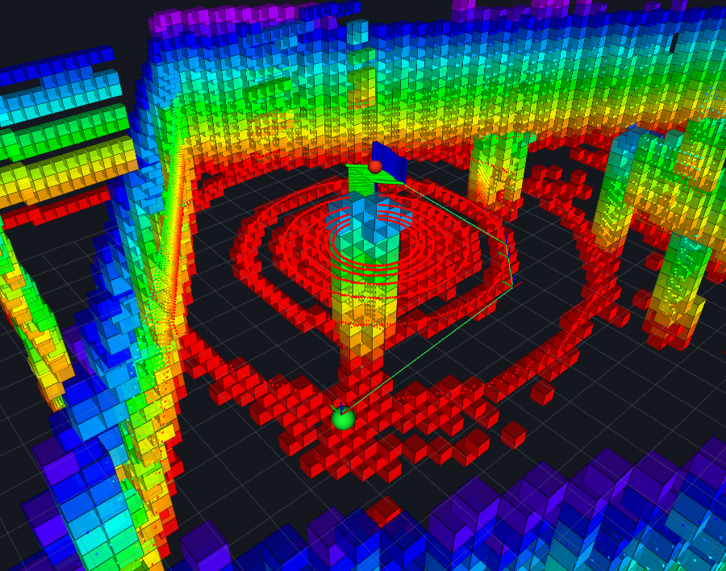
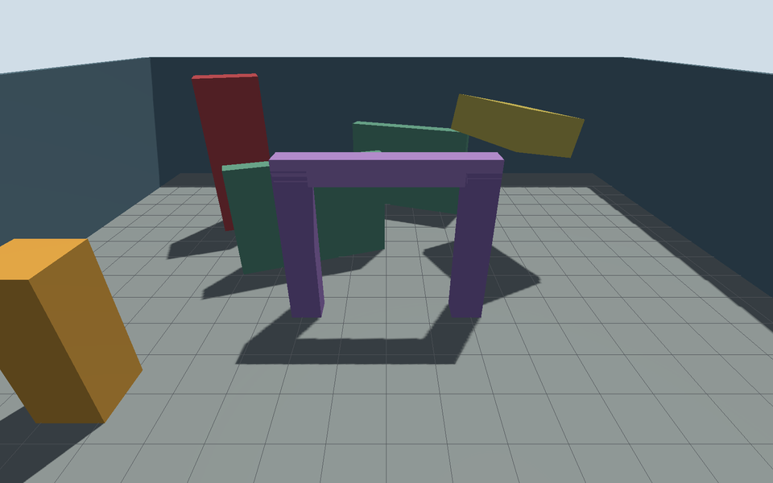
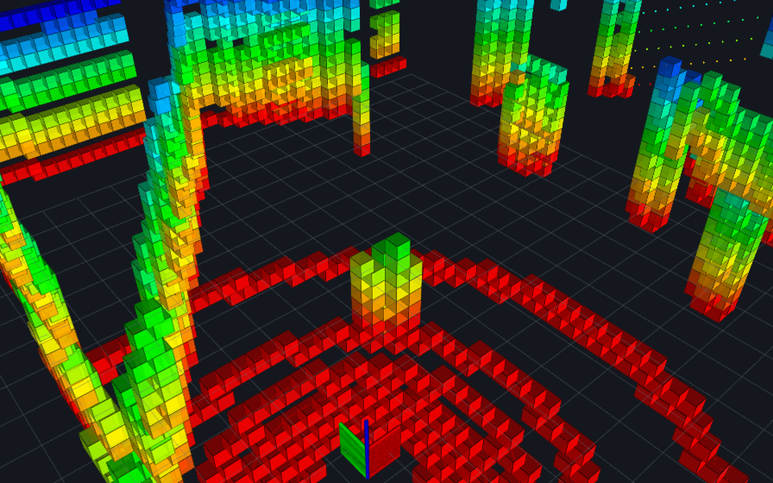
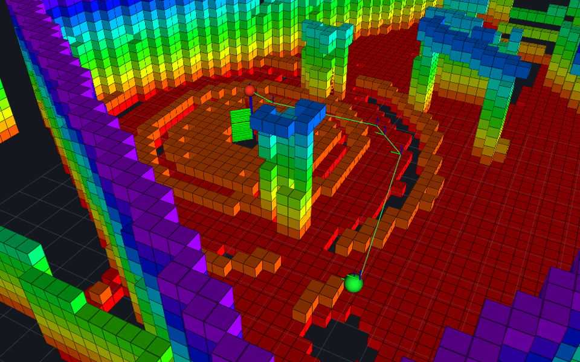
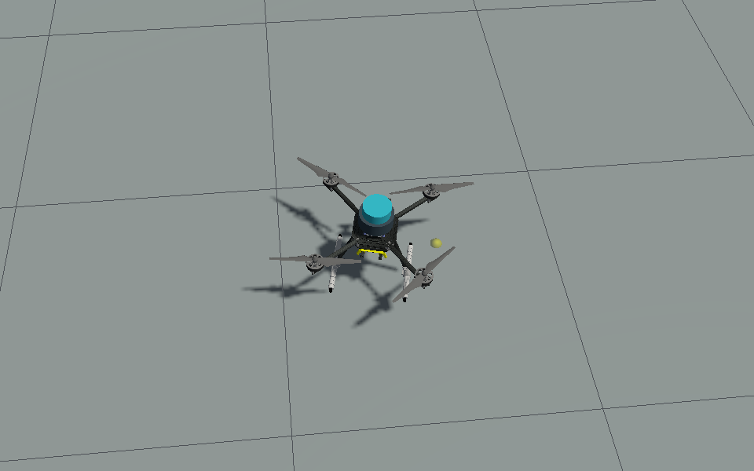
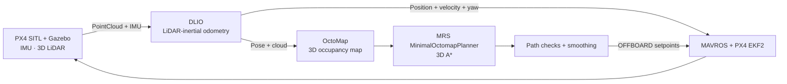

# PX4 3D LiDAR Navigation Demo

一个可复刻、可实时观察的无人机三维导航仿真：PX4 SITL 在 Gazebo 中接收
3D LiDAR 与 IMU 数据，通过 DLIO 定位、OctoMap 建图、MRS 三维 A* 规划，
最后由 MAVROS OFFBOARD 执行路径并自动降落。

<p align="center">
  <a href="https://albert17github.github.io/PX4-3D-LiDAR-Nav-Demo/">在线项目报告</a>
  · <a href="docs/REPRODUCE.md">安装与复刻</a>
  · <a href="docs/ARCHITECTURE.md">系统架构</a>
  · <a href="CONTRIBUTING.md">参与贡献</a>
  · <a href="LICENSE">Apache-2.0</a>
</p>

<p align="center">
  
</p>

## 功能

- Gazebo 和 RViz 在 Ubuntu 桌面实时显示，不依赖离线回放。
- 固定 A→B 演示从 `(0, 0, 2.2)` 飞向 `(7, 7, 2.2)`，直线路径被障碍阻断。
- 交互模式支持在 RViz 中连续选择目标，每次落地后无需重启完整仿真。
- 路径不完整、净距不足、里程计过期或 OFFBOARD 状态异常时停止任务并尝试降落。
- 每次运行保存任务结果、截图、视频、OctoMap 和 SHA-256 清单。
- PX4、DLIO、MAVROS 与下载内容均由版本锁或哈希约束，运行时生成在当前 checkout 内。

本仓库不重新实现 SLAM、OctoMap、路径规划或飞控算法。项目代码只负责启动编排、
目标接收、数据连接、路径检查、航点平滑和结果保存。

## 运行画面

<table width="100%">
  <tr>
    <th width="50%">Gazebo 障碍世界</th>
    <th width="50%">RViz 在线三维地图</th>
  </tr>
  <tr>
    <td width="50%"></td>
    <td width="50%"></td>
  </tr>
  <tr>
    <th width="50%">RViz 规划路径</th>
    <th width="50%">到达目标并落地</th>
  </tr>
  <tr>
    <td width="50%"></td>
    <td width="50%"></td>
  </tr>
</table>

四张展示图均为 960×600（16:10），依次展示物理仿真、在线三维地图、
绕障路径和目标点落地。
原图尺寸、来源和 SHA-256 见[图片说明](reports/assets/README.md)。

## 系统架构



| 环节 | 组件 |
|---|---|
| 飞控与状态估计 | PX4 v1.17.0 SITL / EKF2 |
| 物理与传感器 | Gazebo Harmonic / 3D LiDAR |
| 激光惯性里程计 | Direct LiDAR-Inertial Odometry（DLIO） |
| 三维地图 | ROS 2 Jazzy / OctoMap server |
| 三维规划 | MRS MinimalOctomapPlanner / A* |
| PX4 通信与执行 | MAVROS 2.14.0 / OFFBOARD |
| 可视化 | RViz |

## 系统要求

当前支持 Ubuntu 24.04 LTS Desktop `x86_64`。推荐配置为 8 个逻辑 CPU、
12 GiB RAM、4 GiB swap 和 30 GiB 可用磁盘；最低资源与宿主机软件包见
[安装与复刻说明](docs/REPRODUCE.md)。虚拟机需要可用的 X11/XWayland 显示，
并建议启用 3D acceleration。

## 快速开始

```bash
git clone https://github.com/albert17github/PX4-3D-LiDAR-Nav-Demo.git
cd PX4-3D-LiDAR-Nav-Demo

./scripts/check_environment.sh --setup
./setup.sh
./demo.sh --interactive
```

首次 `setup.sh` 会下载固定的上游源码、Ubuntu rootfs 与签名软件包，并在
`runtime/` 中构建约 14 GiB 的项目运行时。安装可以重复执行，已完成且通过
校验的步骤会被复用。

环境检查不会修改代理、DNS、软件源或虚拟机设置。某一步失败时，终端会显示
阶段、退出码和日志路径；修复环境或网络后重新运行 `./setup.sh` 即可。

## 使用方式

固定 A→B 任务：

```bash
./demo.sh
```

RViz 连续选点：

```bash
./demo.sh --interactive
```

等待终端显示 `waiting_for_interactive_goal`，在 RViz 中选择 `2D Goal Pose`，
点击目标位置并拖动设置机头方向。飞行器到达目标并自动降落后，会继续等待下一目标。
完成后在启动终端按 `Ctrl+C`，停止脚本会保存结果并关闭受管进程。

也可以分步运行：

```bash
./scripts/start.sh
./scripts/fly_ab.sh --interactive
./scripts/stop.sh
```

## 参考验证结果

以下数据来自 Ubuntu 24.04 虚拟机中的一次完整冷启动、在线建图、规划、执行和落地：

| 指标 | 参考结果 | 项目边界 |
|---|---:|---:|
| 路径点 | 8 | 完整路径 |
| 路径长度 | 12.753 m | 大于直线距离 |
| 最大横向绕行 | 3.111 m | ≥ 0.55 m |
| 障碍中心最小距离 | 2.856 m | ≥ 1.35 m |
| 目标位置误差 | 0.040 m | ≤ 0.40 m |
| 最终状态 | `AUTO.LAND` / disarmed | 自动降落并解除解锁 |

这些数值用于说明参考环境已经完成闭环，不代表不同硬件、图形驱动或网络环境下的
性能保证。完整视觉说明见[在线项目报告](https://albert17github.github.io/PX4-3D-LiDAR-Nav-Demo/)。

## 输出文件

每次运行创建独立的 `runs/<timestamp>/` 目录，主要结果位于 `evidence/`：

- `mission-result.json`：路径指标、任务事件和最终误差；
- `rviz-ab-demo.mp4`：RViz 运行视频；
- PNG：Gazebo、RViz 与最终状态图片；
- `final-octomap.bt`：最终 OctoMap；
- `sha256.txt`：证据文件哈希。

运行目录由 `.gitignore` 排除，不会被意外提交到仓库。

## 适用范围

- 当前场景只验证静态障碍绕行，不包含动态障碍预测或自主探索。
- 当前规划配置允许穿越未知空间，仅适用于受控仿真演示。
- 本项目是 SITL 研究演示，不是飞行认证软件，也不能直接作为真实无人机安全策略。
- 迁移到实机前必须重新处理传感器标定、时钟同步、坐标系、通信时延、失联策略和安全边界。

## 文档与贡献

- [安装与复刻](docs/REPRODUCE.md)
- [系统架构与航向权限](docs/ARCHITECTURE.md)
- [参与贡献](CONTRIBUTING.md)
- [第三方组件与许可证](THIRD_PARTY_NOTICES.md)
- [Apache License 2.0](LICENSE)

提交 issue 或 pull request 前请阅读 [CONTRIBUTING.md](CONTRIBUTING.md)。改动应
保持“连接成熟组件、不重写上游算法”的项目边界。
